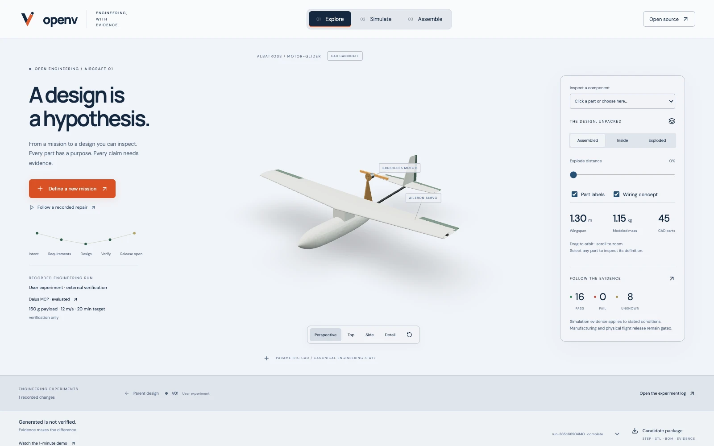
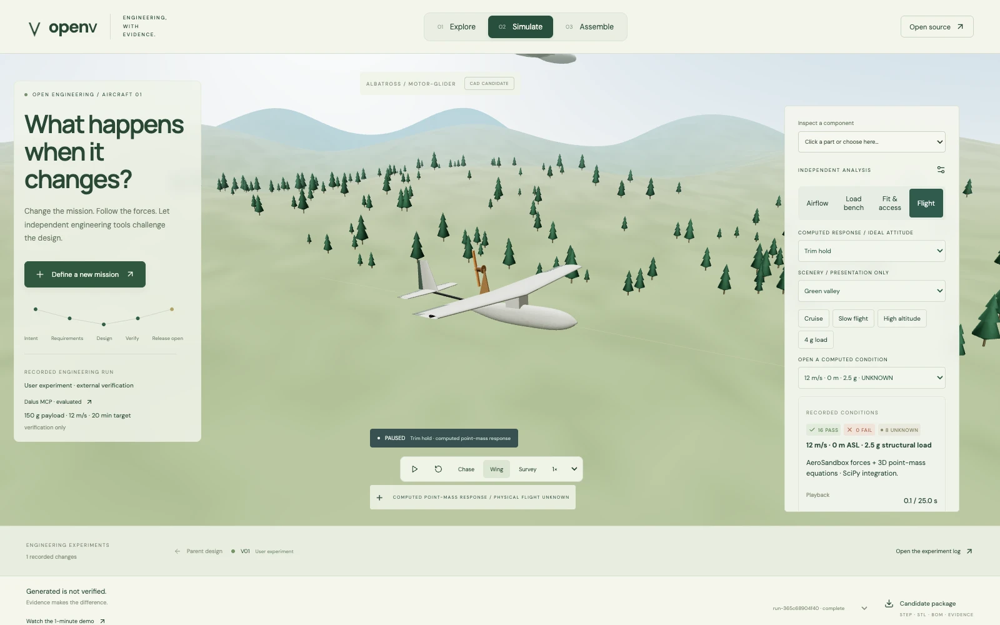
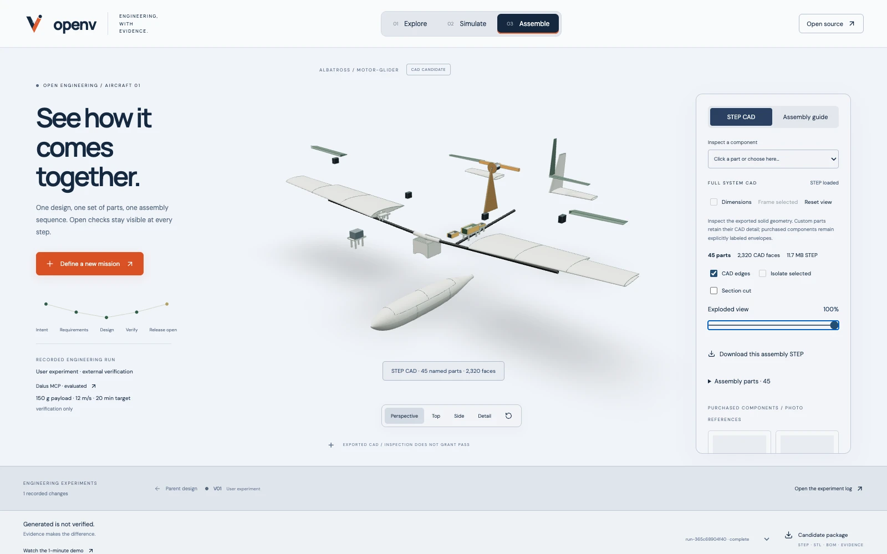
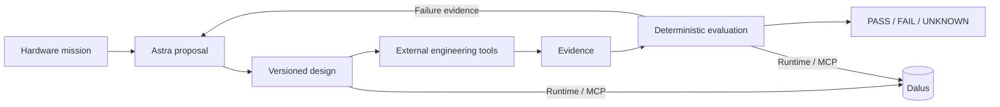

<div align="center">


### AI-generated hardware is a hypothesis.

**Astra proposes. Tools execute. Evidence decides.**

An open-source engineering pipeline that turns a hardware mission into a design, challenges it with independent tools, and uses the failure evidence to drive redesign.

[**Explore the demo ↗**](https://openv-kohl.vercel.app) · [Watch a recorded demo](https://openv-kohl.vercel.app/demo/openv-demo.mp4) · [Get started](docs/GETTING_STARTED.md) · [Documentation](docs/README.md)

[](LICENSE)


[](docs/GETTING_STARTED.md#connect-dalus-through-mcp)

[](https://openv-kohl.vercel.app/?run=run-365c68904f40)

*Actual application capture. 16 modeled checks pass; 8 requirements remain UNKNOWN. Physical flight is not verified.*

</div>

## The problem

AI can produce a convincing CAD model without proving that it fits, survives its loads, can be assembled, or meets the mission. OpenV closes that gap with an explicit engineering loop:

**Intent → requirements → design → verify → fail → redesign → verify again.**

Astra proposes requirements, designs and engineering experiments. External CAD checks, calculations and solvers produce evidence. Trusted deterministic comparisons decide **PASS / FAIL / UNKNOWN**. The LLM cannot grade its own work.

## One real failure. One measured repair.

The first reference system is **Albatross 01**, a small electric RC motor-glider. In an actual Astra run, the battery intersected both tail-servo mounts and obstructed insertion. Astra received those measurements and proposed a 3.6 mm forward move.

| | Initial design | Re-verified design |
|---|---:|---:|
| Battery x position | 411.6 mm | 408.0 mm |
| Battery / mount collision pairs | 2 | 0 |
| Static overlap per mount | 10.45 mm³ | 0 mm³ |
| Dependent evidence invalidated | — | 7 records |
| Scoped component fit and insertion | FAIL | PASS |

[**Inspect the failure**](https://openv-kohl.vercel.app/?run=run-dcef3705d89d&view=fit&version=design-7e5e14a82ca4) · [Inspect the repaired candidate](https://openv-kohl.vercel.app/?run=run-dcef3705d89d&view=fit)

The result is **16 PASS / 0 FAIL / 8 UNKNOWN**. Both versions update the same persistent Dalus model through MCP, preserving the engineering history. A later verification of the unchanged repaired candidate adds computed flight-response diagnostics and a [candidate package with 70 verified artifact hashes](https://openv-kohl.vercel.app/artifacts/run-365c68904f40/candidate-package.zip).

## Explore the output

| Simulation | CAD and assembly |
|---|---|
| [](https://openv-kohl.vercel.app/?run=run-365c68904f40&view=flight) | [](https://openv-kohl.vercel.app/?run=run-365c68904f40&view=assemble) |
| AeroSandbox-based airflow and point-mass flight diagnostics, structural-load views and explicit model assumptions. | Real STEP import, 45 named parts, explosion, section cuts, part isolation, CAD bounds, sourced specifications and assembly instructions. |

Screenshots show the actual application and generated CAD. Flight scenery is illustrative; trajectories are model predictions. Purchased components currently use labeled envelopes, with manufacturer reference photos where available. [Image provenance](docs/images/README.md).

## What makes the pipeline useful

- **External verification:** geometry, engineering calculations and solvers supply the evidence; successful tool execution alone proves nothing.
- **Automatic invalidation:** a design change makes dependent evidence stale; unchanged applicable evidence can be reused.
- **Traceable experiments:** every redesign records its problem, hypothesis, change, expected effect and actual effect.
- **Dalus through MCP:** requirements, architecture, parameters, interfaces, tests and evidence live in one persistent engineering model. An explicit local store supports account-free development.
- **Consistent artifacts:** CAD, analysis and package outputs derive from the same versioned design state. CAD is an output, not the engineering authority.
- **Replaceable adapters:** the aircraft is the first working reference domain. Other domains can reuse the orchestration, contracts, evidence evaluation and storage boundaries.



## Run locally

Python 3.12 and Node 20.19+ or 22.12+ are required. Native CAD/solver work takes several minutes.

```sh
git clone https://github.com/sebastianvkl/OpenV.git
cd OpenV
python3 -m venv .venv
source .venv/bin/activate
pip install -e '.[test]'
npm ci --prefix web
npm run build --prefix web
OPENV_STORE=local python -m openv.cli --offline --run-id first-example
uvicorn openv.server:app --host 127.0.0.1 --port 8000
```

Open **http://127.0.0.1:8000**. The explicit offline proposer is a deterministic fixture; it runs real CAD and engineering checks but makes no Astra call. Use a new run ID for each execution.

To use Astra, copy `.env.example` to `.env`, configure your key/model access, and run the CLI without `--offline`. To connect Dalus, run `python -m openv.dalus login` and configure the MCP store. See [Getting started](docs/GETTING_STARTED.md) for the full setup, development workflow and persistent-model configuration.

## Project structure

```text
openv/       Engineering loop, contracts, domain and tool adapters
web/         React workbench, Three.js scenes and browser STEP reader
tests/       Verification, invalidation, CAD and integration regressions
docs/        Architecture, decisions, guides and current execution status
deploy/      Python host and Vercel deployment setup
.github/     Issue forms and contribution workflow
```

Start in [`openv/pipeline.py`](openv/pipeline.py) for orchestration, [`openv/core.py`](openv/core.py) for the verification rules, and [`openv/dalus_store.py`](openv/dalus_store.py) for the persistent MCP record. The [repository map](docs/REPOSITORY_MAP.md) explains the remaining modules.

| Guide | Purpose |
|---|---|
| [Verification philosophy](docs/VERIFICATION_PHILOSOPHY.md) | Evidence, authority, invalidation and honest unknowns |
| [Domain adapters](docs/DOMAIN_PACKS.md) | Add a verifier or hardware domain |
| [Architecture and decisions](docs/DECISIONS.md) | Boundaries, tradeoffs and changes over time |
| [Execution plan](docs/EXECUTION_PLAN.md) | Completed work and remaining scope |
| [Contributing](CONTRIBUTING.md) | Development checks and useful contributions |
| [Deployment](deploy/README.md) | Vercel website plus native Python engineering host |

## Current scope

This is a **manufacturing candidate, not a flight release**. Endurance, full-airframe strength, joints/retention, wiring/control installation and physical flight still need admissible evidence. The public mission schema and viewer are aircraft-specific. A minimal bracket regression demonstrates the generic runtime boundary; a second complete production domain is not implemented.

AeroSandbox analysis, build123d/OpenCascade geometry checks, Dalus MCP and the browser viewer are implemented. Native Onshape automation, RMFG integration and a fully verified physical aircraft are not. A STEP handoff can be imported into external CAD tools.

The [recorded video](https://openv-kohl.vercel.app/demo/openv-demo.mp4) shows an earlier real Astra spar-redesign example. The linked installation and flight examples above include newer work. The [current recording plan](docs/DEMO_PLAN.md) describes the latest submission story.

## Contribute and license

Independent verifiers, sourced component data, reproducible failing cases and better assembly checks are especially useful. Read [CONTRIBUTING.md](CONTRIBUTING.md) before opening a change. Every new PASS needs evidence; missing information stays UNKNOWN.

OpenV application code is **[MIT licensed](LICENSE)**. Dependencies retain their own licenses. The separately loaded `occt-import-js@0.0.23` browser reader is LGPL-2.1; its source/build link and license are served at `/cad-kernel/NOTICE.txt`. Manufacturer facts and reference photos retain source attribution. Dalus and OpenAI are external services, not bundled products. The reference assembly explorer inspired the interaction; none of its assets were copied.
